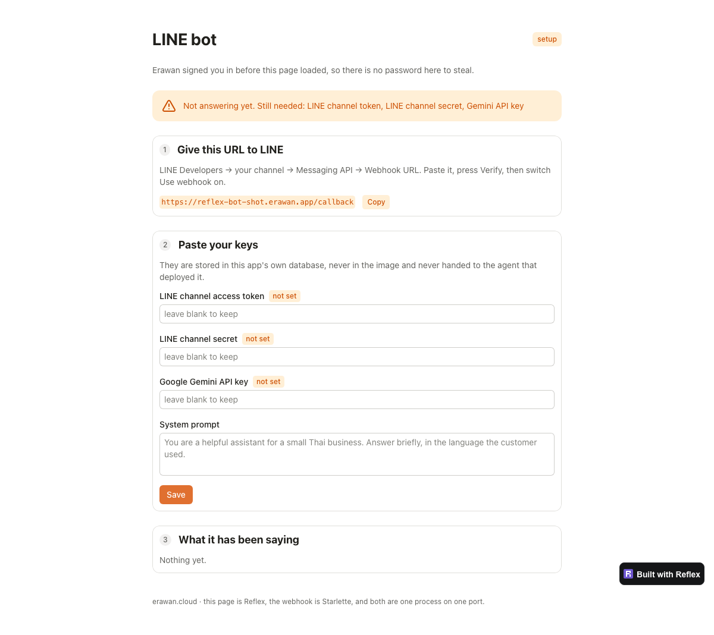
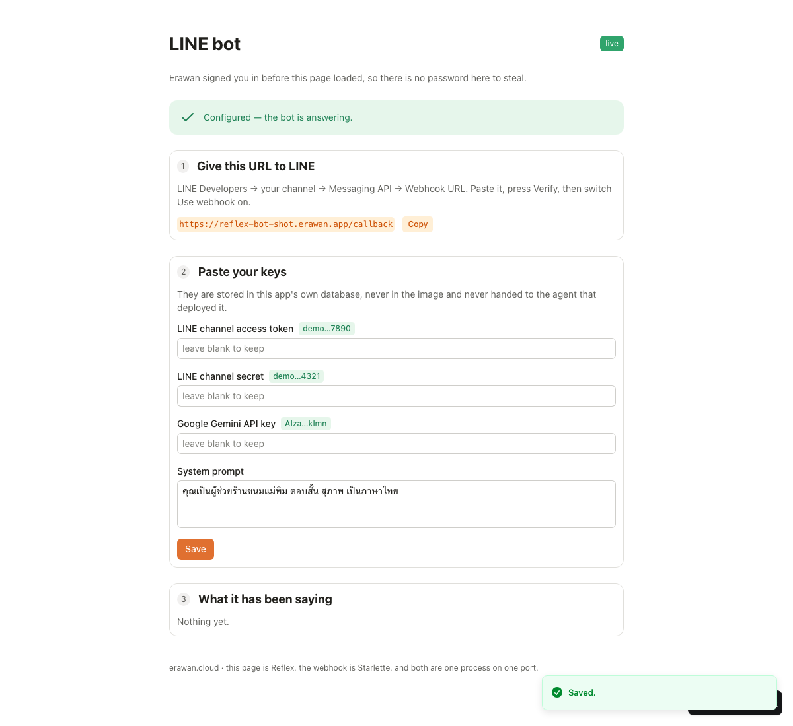
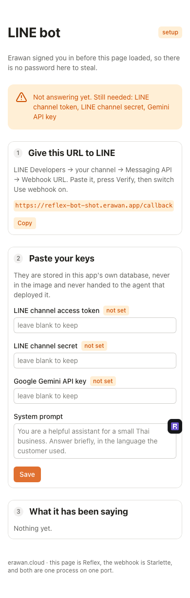

# LINE chatbot starter

A LINE Official Account bot that answers with Google Gemini, remembers each
conversation in Postgres, and has an admin page only you can open — where you
paste your keys, so they are never in the code, never in the image, and never in
an AI agent's context.

**The whole app is Python.** The page is [Reflex](https://reflex.dev), the
webhook is Starlette, and both are one process on one port.

Two commands to put it online on [Erawan](https://erawan.cloud).

**อ่านภาษาไทยด้านล่าง** ↓



---

## Deploy it

```bash
erawan deploy . --name my-line-bot --access owner --public-path /callback
erawan addon add my-line-bot postgres
```

`--public-path /callback` is the load-bearing flag. `--access owner` gates the
whole app, and a bot behind a login receives nothing from LINE; that flag opens
exactly one path — `pathType: Exact`, so `/callback-admin` is *not* opened along
with it.

The first boot has no database: that is the documented order, and the app says
"still needed: database add-on" instead of crash-looping. Attach the add-on,
then open the page.

## Point LINE at it

1. [LINE Developers](https://developers.line.biz/) → your Messaging API channel
2. **Webhook URL**: the address the admin page shows you → Verify
3. Turn **Use webhook** on, turn **Auto-reply messages** off
4. Copy the **Channel access token** and the **Channel secret**
5. Get a Gemini key at [aistudio.google.com](https://aistudio.google.com/apikey)
6. Paste all three on the admin page and save
7. Add the OA as a friend and say something

The banner turns green and the badge reads **live** when nothing is missing.



It is the same page on a phone, which is where a shop owner will actually open
it:



## What is in here

| File | What it holds |
|---|---|
| `line_bot/line_bot.py` | the admin page — Reflex components and one `rx.State` |
| `line_bot/webhook.py` | `POST /callback`, the LINE signature, the Gemini call, and the routes that serve the built page |
| `line_bot/store.py` | two tables and the queries against them, in plain psycopg |
| `rxconfig.py` | Reflex config — read the `api_url` comment before changing it |
| `Dockerfile` | two stages: build the page with Node, run it without |

## Three things worth knowing before you change it

**One process, one port, and that is a security property.** Reflex normally runs
two services — a frontend and a backend. Gating only the frontend would leave
`/_event` open, and `/_event` is where the state that holds your keys lives: a
lock on the door of a room with no wall. So the frontend is exported at build
time and served by the same Starlette app that answers `/callback`, and one
`--access owner` covers both.

**`api_url` stays `localhost` on purpose.** It is baked into the compiled page,
so an absolute hostname would tie one build to one address. Reflex's client
rewrites a `localhost` backend URL to `window.location.hostname` at runtime —
including ws→wss and http→https — so this image runs under any app name and any
domain. An empty string does not work: the client calls `new URL()` on it and
the export fails.

**The keys are not environment variables.** The usual way to set them is to hand
them to whatever agent is doing the deploy — and that agent is the party you
least want holding a channel access token. This app asks *you*, on a page only
you can open, and writes them to its own database.

## Change it

`line_bot/` is about 400 lines. The parts worth editing:

- `store.DEFAULT_SYSTEM_PROMPT` — how the bot talks before you override it on the page
- `store.history(..., limit=10)` — how much of the conversation Gemini sees
- `webhook.ask_gemini` — swap in another provider; it is one HTTP call
- `line_bot.index()` — the page itself, in Python

Redeploy with the same name and the same flags:

```bash
erawan deploy . --name my-line-bot --access owner --public-path /callback
```

To run it on your own machine:

```bash
uv venv --python 3.13 && uv pip install -r requirements.txt
export DATABASE_URL=postgresql://...
reflex run
```

The "Built with Reflex" badge is Reflex's default. `show_built_with_reflex=False`
in `rxconfig.py` removes it — check Reflex's terms for your case first.

---

# แชตบอท LINE (สตาร์ตเตอร์)

บอท LINE OA ที่ตอบด้วย Google Gemini จำบทสนทนาลง Postgres และมีหน้าแอดมินที่
เปิดได้เฉพาะคุณ — คีย์ทั้งหมดพิมพ์ในหน้านั้น ไม่อยู่ในโค้ด ไม่อยู่ในอิมเมจ และ
ไม่ผ่านมือเอไอที่ช่วยคุณ deploy

**เป็น Python ทั้งแอป** หน้าเว็บคือ [Reflex](https://reflex.dev) webhook คือ
Starlette และทั้งคู่เป็นโปรเซสเดียว พอร์ตเดียว

## ขึ้นระบบ

```bash
erawan deploy . --name my-line-bot --access owner --public-path /callback
erawan addon add my-line-bot postgres
```

`--public-path /callback` คือหัวใจ — `--access owner` ล็อกทั้งแอป ถ้าไม่เปิดทางนี้
LINE ยิง webhook เข้าไม่ได้เลย และมันเปิดแค่ path เดียวจริง ๆ (`pathType: Exact`)

บูตครั้งแรกยังไม่มีฐานข้อมูล — ถูกต้องตามลำดับ แอปจะบอกว่ายังขาดอะไร ไม่พัง
ต่อ add-on แล้วค่อยเปิดหน้าแอดมิน

## ตั้งค่าฝั่ง LINE

1. [LINE Developers](https://developers.line.biz/) → ช่อง Messaging API ของคุณ
2. **Webhook URL**: ใช้ที่อยู่ที่หน้าแอดมินแสดงให้ → กด Verify
3. เปิด **Use webhook** · ปิด **Auto-reply messages**
4. คัดลอก **Channel access token** และ **Channel secret**
5. ขอคีย์ Gemini ที่ [aistudio.google.com](https://aistudio.google.com/apikey)
6. วางทั้งสามค่าในหน้าแอดมิน แล้วบันทึก
7. เพิ่มเพื่อน OA แล้วทักไปหาบอท

ครบเมื่อไหร่ แถบจะเป็นสีเขียวและป้ายมุมขวาเปลี่ยนเป็น **live**

## สามเรื่องที่ควรรู้ก่อนแก้

**โปรเซสเดียว พอร์ตเดียว และนี่คือเรื่องความปลอดภัย** ปกติ Reflex รันสองบริการ
ถ้าล็อกแค่ฝั่งหน้าเว็บ `/_event` จะยังเปิดอยู่ ซึ่งเป็นที่ที่ state เก็บคีย์ของคุณ —
เท่ากับใส่กุญแจประตูห้องที่ไม่มีผนัง เราจึง export หน้าเว็บตอน build แล้วให้
Starlette ตัวเดียวกับที่รับ `/callback` เสิร์ฟ `--access owner` อันเดียวคุมทั้งคู่

**`api_url` เป็น localhost โดยตั้งใจ** ค่านี้ถูกฝังลงหน้าเว็บตอน build ถ้าใส่
hostname จริงจะผูกหนึ่ง build กับหนึ่งที่อยู่ — ฝั่ง client ของ Reflex จะเขียนทับ
localhost ด้วย `window.location.hostname` ตอนรัน พร้อมสลับ ws→wss และ
http→https ให้ อิมเมจเดียวจึงใช้ได้ทุกชื่อแอปทุกโดเมน (ใส่ค่าว่างไม่ได้ client
เรียก `new URL()` แล้ว export พัง)

**คีย์ไม่ใช่ตัวแปรสภาพแวดล้อม** วิธีปกติคือยื่นให้เอไอที่กำลัง deploy ให้ ซึ่งเป็น
ฝ่ายที่คุณควรให้ถือ channel access token น้อยที่สุด แอปนี้ถามคุณเองในหน้าที่มีแต่
คุณเปิดได้ แล้วเก็บลงฐานข้อมูลของมันเอง

---

MIT
